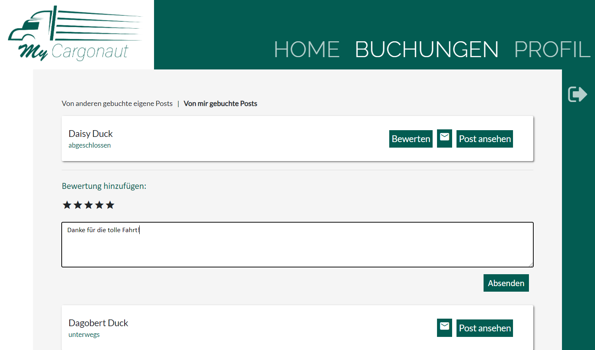
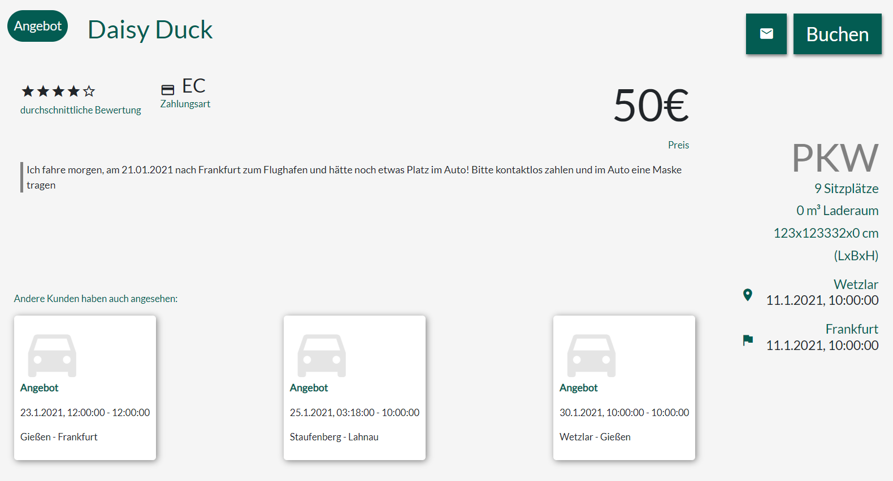
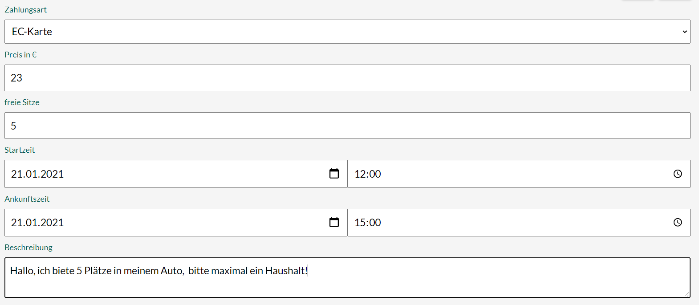

   

<h2 align="center">My Cargonaut</h2>

  Mein Cargonaut ist eine Angular-Web-Applikation um Angebote und Gesuche für private Speditionen und Mitfahrgelegenheiten aufzugeben. Der Kunde, auch Cargonaut genannt, kann für *0,99€ monatlich das Angebot nutzen. Nach der Registrierung können Cargonauten ihr Profil, Fahrzeuge und ihre Posts verwalten.

*_Hinweis: Dies ist ein fiktionales Projekt des Moduks 'Konzepte moderner Softwareentwicklung'. Es werden keine Kosten erhoben._

Dieses Projekt wurde generiert mit [Angular CLI](https://github.com/angular/angular-cli) version 11.0.4.

# Inhaltsverzeichnis

- [Das Projekt aufsetzen](#Das-Projekt-aufsetzen)
- [Paketübersicht](#Verwendete-Pakete)
- [Testing und CI/CD](#Testing-und-CI/CD)
- [Projektplanung und Konventionen](#Projektplanung-und-Konventionen)
- [Funktionalität von MyCargonaut](#Funktionalität-von-MyCargonaut)

## Das Projekt aufsetzen
- [Das Projekt forken](https://github.com/Dxree/MyCargonaut)
- Installiere [node.js](https://github.com/nodejs)
- Importiere [die SQL-Datenbank](https://github.com/Dxree/MyCargonaut/blob/main/config/cargonaut_new.sql) into a preferred SQL-Webserver-Application.
- Du wirst die [server.ts](https://github.com/Dxree/MyCargonaut/blob/main/server.ts) nicht compilieren brauchen.
- Rufe die [config.skeleton](https://github.com/Dxree/MyCargonaut/blob/main/config/config.skeleton) auf, generiere anhand dieser eine neue config.ts und verändere die Einstellungen falls nötig. Dann kompiliere deine config.ts.
- Installiere die [package.json](https://github.com/Dxree/MyCargonaut/blob/main/package.json) via `npm install`
- Um das Projekt mitsamt des Servers zu starten schreibe `ng run MyCargonaut:serve-ssr` in die Konsole des Projektpfads oder starte es einfach über die [package.json](https://github.com/Dxree/MyCargonaut/blob/main/package.json).
- Jetzt sollte das Projekt local auf localhost laufen (siehe Konsole).

## Verwendete Pakete

# Testing und CI/CD

## Development server

Run `ng run MyCargonaut:serve-ssr` for a dev server. Navigate to `http://localhost:4200/`. The app will automatically reload if you change any of the source files.
If you just want to start the Angular FrontEnd Webserver, type `ng serve` or `ng build --watch` or just compile the Angular project with `ng build`

## Code scaffolding

Run `ng generate component component-name` to generate a new component. You can also use `ng generate directive|pipe|service|class|guard|interface|enum|module`.

## Build

Run `ng build` to build the project. The build artifacts will be stored in the `dist/` directory. Use the `--prod` flag for a production build.

## Running unit tests

Run `ng test` to execute the unit tests via [Karma](https://karma-runner.github.io).

## Running end-to-end tests

Run `ng e2e` to execute the end-to-end tests via [Protractor](http://www.protractortest.org/).

## Further help

To get more help on the Angular CLI use `ng help` or go check out the [Angular CLI Overview and Command Reference](https://angular.io/cli) page.

# Projektplanung und Konventionen

## Vom Wireframe zum Prototyp

Eine Erstellung einer groben Skizze stellt den ersten Schritt zur Websitegestaltung dar. Darauf wurden Wireframes aufgebaut, welche bereits eine grobe Skizzierung der Websitefunktionalität darstellen. Diese wiederum wurden nach der Auswahl von Farb- und Stilkonventionen in einen Prototypen umgesetzt.

<h2 align="center"><a href="<a href="https://github.com/Dxree/MyCargonaut/tree/main/documentation/Skizze">Skizze</a></h2>

   

<h1 align="center">
  ↓
</h1>

<h2 align="center"><a href="<a href="https://github.com/Dxree/MyCargonaut/tree/main/documentation/Wireframes">Wireframe</a></h2>

   

<h1 align="center">
  ↓
</h1>

<h2 align="center"><a href="<a href="https://www.figma.com/proto/SRY39RYSBVFst1yHjrowCf/KMS-My-Cargonaut?node-id=4%3A18&scaling=min-zoom">Prototyp</a></h2>

   

## UML-Klassendiagramm

Es wurde für eine bessere Strukturierung des Projektes ein UML-Klassendiagramm erstellt. Die zentrale Einheit als Nutzer bildet der Cargonaut. Dieser kann Posts erstellen und besitzt Fahrzeuge. Außerdem kann er als Fahrer oder Teilnehmer einer Fahrt ein Fahrzeug nutzen und Bewertung abgeben/erhalten. Zusätzlich kann ein Cargonaut Chatnachrichten in Chats verfassen, welche jeweils immer genau 2 Cargonauten zugeordnet sind.

   

## Datenbankmodell
Während der Aufbau ähnlich wie beim Klassenmodell ist, wurden beim Datenbankmodell die Primär- und Fremdschlüssel ergänzt und diese miteinander verknüpft. Beim Löschen werden verknüpfte Einträge ebenfalls gelöscht, um das Ansammeln von Datenleichen zu verhindern und trotzdem zu gewährleisten, dass ein Nutzer etwas löschen kann. Außerdem wurden kleinere Anpassungen im Vergleich zum Klassenmodell vorgenommen. Beispielsweise durch die Zwischentablle "buchung".

   

## Wichtige Projektkonventionen

### Projektplanung

Die Projektplanung erfolgt über User Stories, die in Github Cards geschrieben und in ein [Kanban-Board](https://github.com/Dxree/MyCargonaut/projects/1) eingepflegt.
Dabei ist wichtig, dass wöchtentlich eine Planung statt findet und Cards entsprechend in ToDo geschoben werden. Jeder Autor muss seine eigenen zugeteilten Cards verschieben. Im wöchentlichen Meeting werden dann auch alle Cards reviewt (siehe "needs review"), bevor sie in Done verschoben werden dürfen oder erneut in den Kanban-Prozess eingepflegt werden müssen.

### Dokumentation

Werden neue Funktionalitäten in MyCargonaut eingepflegt, zusätzliche Pakete oder lizensierte Produkte verwendet, so sind diese entsprechend in der Dokumentation anzugeben.

### Testing

Für genauere Erklärung siehe [Testing und CI/CD](#Testing-und-CI/CD). Für neue Angular-Komponenten oder neue Angular-Services sind in der entsprechenden spec-Datei der Komponente / des Services Tests nach den Konventionen der [Angular-Testing Dokumentation](https://angular.io/guide/testing-services) zu schreiben.

### Farbkonvention

Folgende Farben sind zu verwenden:

<ul>
  <li style="color: #005b52">Grün: #005b52</li>
  <li style="color: #005b52">Hell-Grau: #f5f5f5</li>
  <li style="color: #005b52">Mittleres Grau: #e5e5e5</li>
  <li style="color: #005b52">Dunkel-Grau: #c4c4c4</li>
  <li style="color: #005b52">Weiss: #005b52</li>
</ul>

  
### Sprachkonvention

Die Dokumentation ist in Deutsch zu verfassen. Der Code, Variablen, Funktionen etc. sind in Englisch anzugeben und die Seitentexte sind auf Deutsch (siehe [Prototyp](#Projektplanung-und-konventionen)).

### Programmierkonvention

Für Bezeichner aus mehreren Wörtern ist der CamelCase zu verwenden.
Es ist sind soweit möglich die Programmierkonventionen von [Angular](https://angular.io/guide/property-binding-best-practices) einzuhalten.
Parallel zur Entwicklung sind entsprechende Tests zu schreibe, siehe [Testing und CI/CD](#Testing-und-CI/CD).
Die Verwendung von Bootstrap Flexbox und eine dementsprechende Responsivität ist erwartet.

# Funktionalität von MyCargonaut

## Startseite
Auf der Startseite der Anwendung sind aktuelle Posts von anderen Cargonauten zu sehen. Mit verschiedenen Filteroptionen 
lassen sich die Suchergebnisse einschränken. Außerdem gibt es ein Suchfeld, um nach Posts mit spezifischen Inhalten zu suchen.

   

## Authentifizierung
Über die Navbar kommt der Nutzer außerdem zur Registrierung oder zur Anmeldung. (siehe Bild oben)

Über den Button "Registrieren" bekommt der Nutzer die Möglichkeit, einen neuen Cargonauten auf der Plattform anzulegen und sich anschließend mit diesem anzumelden.

   

Über den Button "anmelden" können sich Nutzer, die bereits ein Nutzerprofil haben, in ihr Profil einloggen. Dadurch können selbst Posts erstellt und gebucht, 
sowie das persönliche Profil bearbeitet werden.

    

## Persönliches Profil
Nach der Anmeldung ist der Button "Profil" in der Navigationsleiste sichtbar. Dieser führt zum eigenen Profil, welches die bei der Registrierung angegebenen Informationen beinhaltet.

    

### Fahrzeugverwaltung
Über den Button "Fahrzeug hinzufügen" kann der Nutzer Fahrzeuge in seinem persönlichen Profil hinterlegen. Hierbei kann er Typ, Modell, Anzahl der 
Sitzplätze und einen Kommentar eingeben. Die Informationen über die erstellten Fahrzeuge werden direkt im Profil dargestellt und können hier bearbeitet werden. Außerdem kann man Fahrzeuge durch das Lösch-Symbol aus der Liste entfernen.

Die Fahrzeuge können beim Erstellen eines Angebots ausgewählt werden, um so die Daten eines Fahrzeugs in einen Post zu übernehmen.

    

### Bewertungen
Unter dem Abschnitt Bewertungen befinden sich alle Bewertungen, die der Cargonaut zu seinen Fahrten erhalten hat. Mit Klick auf einen Namen lässt sich auch das Profil des Cargonauten einsehen, der die Bewertung geschrieben hat. Eine Bewertung besteht aus einer Punkt/Sternzahl und einem Kommentar.

### Profil bearbeiten
Durch einen Klick auf das Bearbeitungssymbol lassen sich die Nutzerinformationen jederzeit ändern. Weitere Funktionen zur Bearbeitung bzw. Löschung des Profils bieten die Buttons "Passwort ändern", "Profilbild ändern" und "Nutzer entfernen" unterhalb des Profilbildes.

## Post erstellen
Über den "+" - Button auf dem Home Bereich lässt sich ein neuer Post erstellen. Zu Beginn muss entschieden werde, ob es sich um ein Angebot oder ein Gesuch handelt. In beiden Fällen müssen die 
allgemeinen Informationen angegeben werden (Zeit, Startort, Zielort, Bezahlart, Preis, Kommentar). Handelt es sich um ein Angebot, erhält der Nutzer unter "Fahrzeug" eine Liste mit seinen zuvor erstellten Fahrzeugen.
Bei Auswahl eines Fahrzeugs werden die Anzahl der Sitzplätze und der Laderraum in den Post übernommen, können aber auch noch angepasst werden.

    

## Eigene Buchungen einsehen

Angemeldete Benutzer können über den Menüpunkt "Buchungen" aktuelle und vergangene
Buchungen verwalten. Durch Klicken auf die jeweiligen Tab-Überschriften lässt sich
zwischen Buchungsein- und Ausgang umschalten: Links befindet sich eine Übersicht 
aller Buchungen, die zu einem Post gehören, der vom angemeldeten Benutzer erstellt
wurde. Im rechten Tab sind alle Posts aufgelistet, die vom Cargonauten selbst
gebucht wurden.

In der Buchungsübersicht sind Buchungsstatus ("aufgetragen", "unterwegs" oder "abgeschlossen")
und der Name des Postautors angezeigt. Für mehr Informationen muss der Benutzer
über den entsprechenden Button auf die Post-Detailseite navigieren.
Die Ansicht in der Postübersicht bietet außerdem einen direkten Link zum Chat mit dem
Autor des Posts, sowie für abgeschlossene Buchungen die Möglichkeit, eine Buchung zu bewerten.

#### Buchung bewerten

Über den Button "Bewerten" öffnet sich ein Akkordionelement, in dem der Benutzer eine
kurze Bewertung für den Autor des Posts hinterlassen kann. Dazu kann er einen bis fünf
Sterne vergeben, sowie einen Kommentar im Freitextfeld hinterlassen. Wird eine Bewertung
abgesendet, folgt eine automatische Weiterleitung auf das Profil des bewerteten Nutzers.

## Post Details

#### Besucher-Ansicht

 Die Post Seite bietet suchenden Cargonauten einige weitere Informationen zu Fahrtdetails,
 Fahrzeug und Autor, sowie die Möglichkeit, die Fahrt zu buchen oder mit dem Autor Kontakt aufzunehmen.
 
 Wichtig für den Besucher sind vor allem die Informationen über Start- und Zielort der
 Fahrt, Preis und bevorzugte Zahlungsart, sowie die Zeiten und noch verfügbaren Plätze im Fahrzeug (hier wird unterschieden zwischen
 Sitz- und Ladeplätzen). Die Art des gesuchten oder angebotenen Fahrzeugs wird oben rechts
 zusätzlich als Icon angezeigt, hier sind aktuell die Fahrzeugtypen PKW, LKW, Transporter, 
 Schiff und Flugzeug möglich.
 
Um den Cargonauten, der den Post erstellt hat, besser einschätzen zu können, wird auf dem
Post der Durchschnitt aus den bisherigen Bewertungen des Autors angezeigt.

Alle weiteren Informationen müssen aus dem Beschreibungstext entnommen, oder im Chat erfragt
werden.

#### Autoren-Ansicht

Gelangt ein Cargonaut auf einen von ihm selbst verfassten Post, hat er die Möglichkeit,
einige der Postdetails zu bearbeiten. Bearbeitet werden können Preis und Zahlungsart, 
freie Sitze, Start- und Endzeitpunkt sowie die Beschreibung. Außerdem kann der Benutzer,
falls er mehrere Fahrzeuge angelegt hat, über ein Dropdown aus diesen auswählen.

##### Fahrten-Vorschläge

Unter den Postdetails werden drei zufällige weitere Posts aus der Datenbank als 
Vorschaukarten angezeigt, die dem Benutzer Anregungen für weitere verfügbare oder gesuchte Fahrten geben sollen
